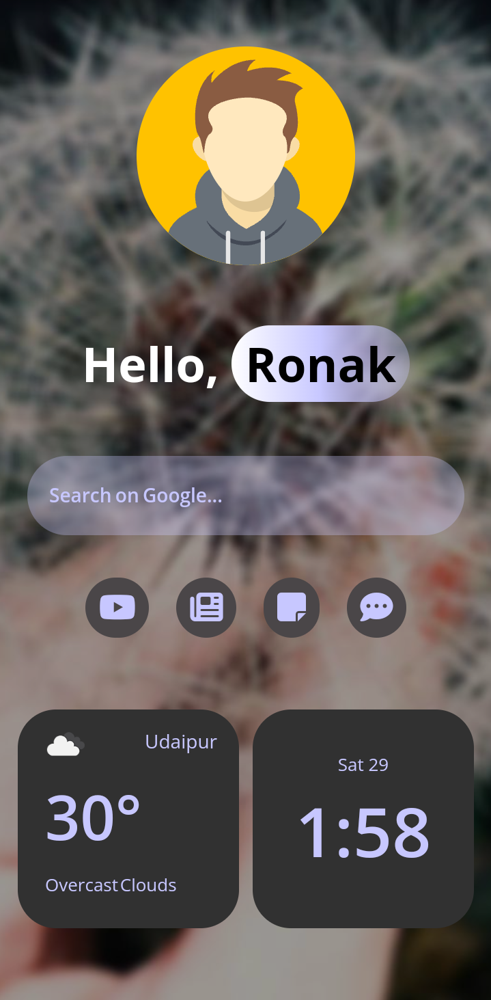
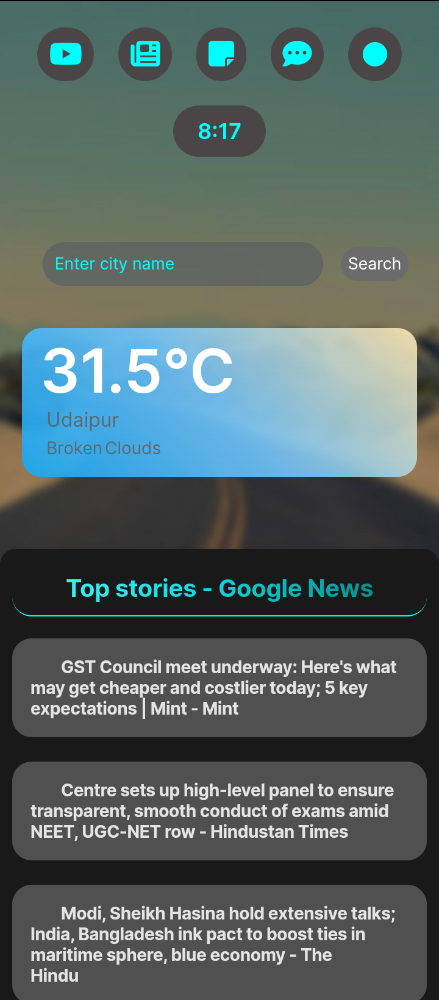

# Awesome Homepage 🌟

Welcome to our awesome homepage project! This is more than just a homepage – it's your personalized gateway to the web.

## You can try it here:
https://my-webpage01.netlify.app

https://ronak-08.github.io/Web-Homepage

## Features 🚀

- **Interactive Icons:** Quickly access your favorite websites with just a click.
- **Dynamic Clock:** Always stay on schedule with a sleek, real-time clock.
- **Customizable:** Personalize your experience by changing your name and accent color right on the homepage.
- **Responsive Design:** Seamlessly adapts to any screen size for a consistent experience on desktop and mobile.
- **Weather:** Provides Latest Weather of your Location.
- **Latest News:** Stay informed with the latest headlines conveniently displayed.
- **Random Background Image:** Random image in background, toogle it in settings.
- **Custom Accent Color:** make your favourite color the accent of the entire website

**Note:** ***Click on name to input new name***
  
## Screenshots 📷

## Get Started 🛠️

1. Clone the repository.
2. Open `index.html` in your web browser.
3. Enjoy exploring the features!

## Contributing 🤝

We welcome contributions! If you have ideas for improvements or new features, feel free to fork the repository and submit a pull request.

## Feedback 💬

Have feedback or questions? We'd love to hear from you! Reach out to us via ronakameta65@gmail.com

